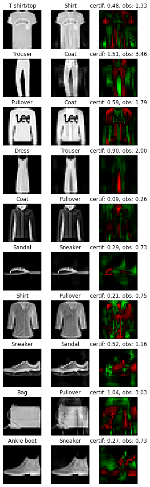

Example 4: HKR multiclass and fooling
=====================================

|Open in Colab|

This notebook will show how to train a Lispchitz network in a multiclass
configuration. The HKR (hinge-Kantorovich-Rubinstein) loss is extended
to multiclass using a one-vs all setup. The notebook will go through the
process of designing and training the network. It will also show how to
compute robustness certificates from the outputs of the network. Finally
the guarantee of these certificates will be checked by attacking the
network.

.. |Open in Colab| image:: https://colab.research.google.com/assets/colab-badge.svg
   :target: https://colab.research.google.com/github/deel-ai/deel-torchlip/blob/master/docs/notebooks/wasserstein_classification_fashionMNIST.ipynb

.. code:: ipython3

    # Install the required libraries deel-torchlip and foolbox (uncomment below if needed)
    # %pip install -qqq deel-torchlip foolbox

1. Data preparation
-------------------

For this example, the ``fashion_mnist`` dataset is used. In order to
keep things simple, no data augmentation is performed.

.. code:: ipython3

    import torch
    from torchvision import datasets, transforms

    train_set = datasets.FashionMNIST(
        root="./data",
        download=True,
        train=True,
        transform=transforms.ToTensor(),
    )

    test_set = datasets.FashionMNIST(
        root="./data",
        download=True,
        train=False,
        transform=transforms.ToTensor(),
    )

    batch_size = 4096
    train_loader = torch.utils.data.DataLoader(train_set, batch_size, shuffle=True)
    test_loader = torch.utils.data.DataLoader(test_set, batch_size)

2. Model architecture
---------------------

The original one-vs-all setup would require 10 different networks (1 per
class). However, we use in practice a network with a common body and a
Lipschitz head (linear layer) containing 10 output neurons, like any
standard network for multiclass classification. Note that each head
neuron is not a 1-Lipschitz function; however the overall head with the
10 outputs is 1-Lipschitz.

Notes about constraint enforcement
^^^^^^^^^^^^^^^^^^^^^^^^^^^^^^^^^^

There are currently 3 ways to enforce the Lipschitz constraint in a
network:

1. weight regularization
2. weight reparametrization
3. weight projection

Weight regularization doesn’t provide the required guarantees as it is
only a regularization term. Weight reparametrization is available in
``torchlip`` and is done directly in the layers (parameter
``niter_bjorck``). This trick allows to perform arbitrary gradient
updates without breaking the constraint. However this is done in the
graph, increasing resources consumption. Weight projection is not
implemented in ``torchlip``.

.. code:: ipython3

    from deel import torchlip

    # Sequential has the same properties as any Lipschitz layer. It only acts as a
    # container, with features specific to Lipschitz functions (condensation,
    # vanilla_exportation, ...)
    model = torchlip.Sequential(
        # Lipschitz layers preserve the API of their superclass (here Conv2d). An optional
        # argument is available, k_coef_lip, which controls the Lipschitz constant of the
        # layer
        torchlip.SpectralConv2d(
            in_channels=1, out_channels=16, kernel_size=(3, 3), padding="same"
        ),
        torchlip.GroupSort2(),
        # Usual pooling layer are implemented (avg, max), but new pooling layers are also
        # available
        torchlip.ScaledL2NormPool2d(kernel_size=(2, 2)),
        torchlip.SpectralConv2d(
            in_channels=16, out_channels=32, kernel_size=(3, 3), padding="same"
        ),
        torchlip.GroupSort2(),
        torchlip.ScaledL2NormPool2d(kernel_size=(2, 2)),
        # Our layers are fully interoperable with existing PyTorch layers
        torch.nn.Flatten(),
        torchlip.SpectralLinear(1568, 64),
        torchlip.GroupSort2(),
        torchlip.SpectralLinear(64, 10, bias=False),
        # Similarly, model has a parameter to set the Lipschitz constant that automatically
        # sets the constant of each layer.
        k_coef_lip=1.0,
    )

    device = torch.device("cuda" if torch.cuda.is_available() else "cpu")
    model.to(device)

.. parsed-literal::

    Sequential model contains a layer which is not a Lipschitz layer: Flatten(start_dim=1, end_dim=-1)

.. parsed-literal::

    Sequential(
      (0): SpectralConv2d(1, 16, kernel_size=(3, 3), stride=(1, 1), padding=same)
      (1): GroupSort2()
      (2): ScaledL2NormPool2d(kernel_size=(2, 2), stride=(2, 2), padding=0)
      (3): SpectralConv2d(16, 32, kernel_size=(3, 3), stride=(1, 1), padding=same)
      (4): GroupSort2()
      (5): ScaledL2NormPool2d(kernel_size=(2, 2), stride=(2, 2), padding=0)
      (6): Flatten(start_dim=1, end_dim=-1)
      (7): SpectralLinear(in_features=1568, out_features=64, bias=True)
      (8): GroupSort2()
      (9): SpectralLinear(in_features=64, out_features=10, bias=False)
    )

3. HKR loss and training
------------------------

The multiclass HKR loss can be found in the ``hkr_multiclass_loss``
function or in the ``HKRMulticlassLoss`` class. The loss has two
parameters: ``alpha`` and ``min_margin``. Decreasing ``alpha`` and
increasing ``min_margin`` improve robustness (at the cost of accuracy).
Note also in the case of Lipschitz networks, more robustness requires
more parameters. For more information, see `our
paper <https://arxiv.org/abs/2006.06520>`__.

In this setup, choosing ``alpha=100`` and ``min_margin=.25`` provides
good robustness without hurting the accuracy too much.

Finally the ``kr_multiclass_loss`` gives an indication on the robustness
of the network (proxy of the average certificate).

.. code:: ipython3

    epochs = 100
    optimizer = torch.optim.Adam(lr=1e-4, params=model.parameters())
    hkr_loss = torchlip.HKRMulticlassLoss(alpha=100, min_margin=0.25)

    for epoch in range(epochs):
        m_kr, m_acc = 0, 0

        for step, (data, target) in enumerate(train_loader):

            # For multiclass HKR loss, the targets must be one-hot encoded
            target = torch.nn.functional.one_hot(target, num_classes=10)
            data, target = data.to(device), target.to(device)

            # Forward + backward pass
            optimizer.zero_grad()
            output = model(data)
            loss = hkr_loss(output, target)
            loss.backward()
            optimizer.step()

            # Compute metrics on batch
            m_kr += torchlip.functional.kr_multiclass_loss(output, target)
            m_acc += (output.argmax(dim=1) == target.argmax(dim=1)).sum() / len(target)

        # Train metrics for the current epoch
        metrics = [
            f"{k}: {v:.04f}"
            for k, v in {
                "loss": loss,
                "acc": m_acc / (step + 1),
                "KR": m_kr / (step + 1),
            }.items()
        ]

        # Compute validation loss for the current epoch
        test_output, test_targets = [], []
        for data, target in test_loader:
            data, target = data.to(device), target.to(device)
            test_output.append(model(data).detach().cpu())
            test_targets.append(
                torch.nn.functional.one_hot(target, num_classes=10).detach().cpu()
            )
        test_output = torch.cat(test_output)
        test_targets = torch.cat(test_targets)

        val_loss = hkr_loss(test_output, test_targets)
        val_kr = torchlip.functional.kr_multiclass_loss(test_output, test_targets)
        val_acc = (test_output.argmax(dim=1) == test_targets.argmax(dim=1)).float().mean()

        # Validation metrics for the current epoch
        metrics += [
            f"val_{k}: {v:.04f}"
            for k, v in {
                "loss": hkr_loss(test_output, test_targets),
                "acc": (test_output.argmax(dim=1) == test_targets.argmax(dim=1))
                .float()
                .mean(),
                "KR": torchlip.functional.kr_multiclass_loss(test_output, test_targets),
            }.items()
        ]

        print(f"Epoch {epoch + 1}/{epochs}")
        print(" - ".join(metrics))

.. parsed-literal::

    Epoch 1/100
    loss: 29.8065 - acc: 0.2169 - KR: 0.1004 - val_loss: 28.8107 - val_acc: 0.4582 - val_KR: 0.1890
    Epoch 2/100
    loss: 19.8997 - acc: 0.5137 - KR: 0.2591 - val_loss: 19.6618 - val_acc: 0.5694 - val_KR: 0.3345
    Epoch 3/100
    loss: 15.5582 - acc: 0.6162 - KR: 0.3930 - val_loss: 15.7906 - val_acc: 0.6218 - val_KR: 0.4501
    Epoch 4/100
    loss: 13.6293 - acc: 0.6692 - KR: 0.4945 - val_loss: 13.8149 - val_acc: 0.6832 - val_KR: 0.5319
    Epoch 5/100
    loss: 12.3328 - acc: 0.7009 - KR: 0.5630 - val_loss: 12.3709 - val_acc: 0.7038 - val_KR: 0.5904
    Epoch 6/100
    loss: 11.2218 - acc: 0.7248 - KR: 0.6149 - val_loss: 11.3854 - val_acc: 0.7161 - val_KR: 0.6349
    Epoch 7/100
    loss: 10.5164 - acc: 0.7351 - KR: 0.6575 - val_loss: 10.7304 - val_acc: 0.7312 - val_KR: 0.6749
    Epoch 8/100
    loss: 9.9036 - acc: 0.7458 - KR: 0.6955 - val_loss: 10.2040 - val_acc: 0.7389 - val_KR: 0.7098
    Epoch 9/100
    loss: 9.4456 - acc: 0.7515 - KR: 0.7283 - val_loss: 9.7864 - val_acc: 0.7461 - val_KR: 0.7404
    Epoch 10/100
    loss: 9.4395 - acc: 0.7565 - KR: 0.7562 - val_loss: 9.4458 - val_acc: 0.7488 - val_KR: 0.7644
    Epoch 11/100
    loss: 8.6899 - acc: 0.7621 - KR: 0.7809 - val_loss: 9.1339 - val_acc: 0.7584 - val_KR: 0.7878
    Epoch 12/100
    loss: 8.8400 - acc: 0.7660 - KR: 0.8033 - val_loss: 8.8585 - val_acc: 0.7603 - val_KR: 0.8114
    Epoch 13/100
    loss: 8.4524 - acc: 0.7698 - KR: 0.8280 - val_loss: 8.6265 - val_acc: 0.7615 - val_KR: 0.8348
    Epoch 14/100
    loss: 8.2200 - acc: 0.7728 - KR: 0.8497 - val_loss: 8.4014 - val_acc: 0.7684 - val_KR: 0.8576
    Epoch 15/100
    loss: 7.5585 - acc: 0.7771 - KR: 0.8733 - val_loss: 8.1770 - val_acc: 0.7731 - val_KR: 0.8779
    Epoch 16/100
    loss: 7.7402 - acc: 0.7789 - KR: 0.8954 - val_loss: 7.9923 - val_acc: 0.7737 - val_KR: 0.9000
    Epoch 17/100
    loss: 7.8116 - acc: 0.7828 - KR: 0.9146 - val_loss: 7.8163 - val_acc: 0.7774 - val_KR: 0.9193
    Epoch 18/100
    loss: 7.3096 - acc: 0.7854 - KR: 0.9364 - val_loss: 7.6657 - val_acc: 0.7784 - val_KR: 0.9392
    Epoch 19/100
    loss: 7.1890 - acc: 0.7892 - KR: 0.9548 - val_loss: 7.5001 - val_acc: 0.7822 - val_KR: 0.9597
    Epoch 20/100
    loss: 7.1856 - acc: 0.7899 - KR: 0.9761 - val_loss: 7.3783 - val_acc: 0.7815 - val_KR: 0.9803
    Epoch 21/100
    loss: 6.8862 - acc: 0.7927 - KR: 0.9959 - val_loss: 7.2480 - val_acc: 0.7829 - val_KR: 1.0005
    Epoch 22/100
    loss: 6.7167 - acc: 0.7966 - KR: 1.0154 - val_loss: 7.1030 - val_acc: 0.7862 - val_KR: 1.0169
    Epoch 23/100
    loss: 6.6035 - acc: 0.7978 - KR: 1.0321 - val_loss: 6.9949 - val_acc: 0.7894 - val_KR: 1.0359
    Epoch 24/100
    loss: 6.5261 - acc: 0.8007 - KR: 1.0522 - val_loss: 6.8867 - val_acc: 0.7925 - val_KR: 1.0526
    Epoch 25/100
    loss: 6.3522 - acc: 0.8023 - KR: 1.0674 - val_loss: 6.7934 - val_acc: 0.7946 - val_KR: 1.0706
    Epoch 26/100
    loss: 6.3714 - acc: 0.8036 - KR: 1.0867 - val_loss: 6.7136 - val_acc: 0.7960 - val_KR: 1.0874
    Epoch 27/100
    loss: 6.2562 - acc: 0.8060 - KR: 1.1034 - val_loss: 6.6595 - val_acc: 0.7958 - val_KR: 1.1038
    Epoch 28/100
    loss: 6.1618 - acc: 0.8081 - KR: 1.1197 - val_loss: 6.5398 - val_acc: 0.7991 - val_KR: 1.1196
    Epoch 29/100
    loss: 6.0123 - acc: 0.8094 - KR: 1.1373 - val_loss: 6.4722 - val_acc: 0.7979 - val_KR: 1.1350
    Epoch 30/100
    loss: 6.1670 - acc: 0.8111 - KR: 1.1519 - val_loss: 6.3815 - val_acc: 0.8038 - val_KR: 1.1519
    Epoch 31/100
    loss: 5.8678 - acc: 0.8132 - KR: 1.1682 - val_loss: 6.2972 - val_acc: 0.8038 - val_KR: 1.1675
    Epoch 32/100
    loss: 5.8205 - acc: 0.8150 - KR: 1.1839 - val_loss: 6.2579 - val_acc: 0.8025 - val_KR: 1.1849
    Epoch 33/100
    loss: 5.8555 - acc: 0.8149 - KR: 1.2006 - val_loss: 6.1964 - val_acc: 0.8069 - val_KR: 1.2005
    Epoch 34/100
    loss: 5.8581 - acc: 0.8176 - KR: 1.2147 - val_loss: 6.1072 - val_acc: 0.8088 - val_KR: 1.2144
    Epoch 35/100
    loss: 5.7316 - acc: 0.8187 - KR: 1.2302 - val_loss: 6.0802 - val_acc: 0.8062 - val_KR: 1.2290
    Epoch 36/100
    loss: 5.9217 - acc: 0.8187 - KR: 1.2449 - val_loss: 5.9837 - val_acc: 0.8122 - val_KR: 1.2463
    Epoch 37/100
    loss: 5.4302 - acc: 0.8219 - KR: 1.2589 - val_loss: 5.9178 - val_acc: 0.8151 - val_KR: 1.2556
    Epoch 38/100
    loss: 5.5795 - acc: 0.8219 - KR: 1.2732 - val_loss: 5.8836 - val_acc: 0.8157 - val_KR: 1.2725
    Epoch 39/100
    loss: 5.5917 - acc: 0.8238 - KR: 1.2878 - val_loss: 5.8426 - val_acc: 0.8138 - val_KR: 1.2899
    Epoch 40/100
    loss: 5.2440 - acc: 0.8242 - KR: 1.3040 - val_loss: 5.7798 - val_acc: 0.8190 - val_KR: 1.2982
    Epoch 41/100
    loss: 5.4507 - acc: 0.8244 - KR: 1.3157 - val_loss: 5.7328 - val_acc: 0.8176 - val_KR: 1.3134
    Epoch 42/100
    loss: 5.2139 - acc: 0.8272 - KR: 1.3277 - val_loss: 5.7118 - val_acc: 0.8166 - val_KR: 1.3298
    Epoch 43/100
    loss: 5.4277 - acc: 0.8277 - KR: 1.3446 - val_loss: 5.6266 - val_acc: 0.8203 - val_KR: 1.3391
    Epoch 44/100
    loss: 5.3023 - acc: 0.8291 - KR: 1.3555 - val_loss: 5.5880 - val_acc: 0.8214 - val_KR: 1.3558
    Epoch 45/100
    loss: 5.3210 - acc: 0.8296 - KR: 1.3705 - val_loss: 5.5427 - val_acc: 0.8206 - val_KR: 1.3683
    Epoch 46/100
    loss: 5.1909 - acc: 0.8298 - KR: 1.3833 - val_loss: 5.4947 - val_acc: 0.8214 - val_KR: 1.3806
    Epoch 47/100
    loss: 4.7530 - acc: 0.8308 - KR: 1.3961 - val_loss: 5.4601 - val_acc: 0.8256 - val_KR: 1.3949
    Epoch 48/100
    loss: 5.3041 - acc: 0.8325 - KR: 1.4094 - val_loss: 5.4323 - val_acc: 0.8238 - val_KR: 1.4044
    Epoch 49/100
    loss: 4.8817 - acc: 0.8327 - KR: 1.4206 - val_loss: 5.3684 - val_acc: 0.8263 - val_KR: 1.4190
    Epoch 50/100
    loss: 5.2699 - acc: 0.8324 - KR: 1.4354 - val_loss: 5.3517 - val_acc: 0.8294 - val_KR: 1.4300
    Epoch 51/100
    loss: 4.8224 - acc: 0.8347 - KR: 1.4470 - val_loss: 5.3209 - val_acc: 0.8250 - val_KR: 1.4453
    Epoch 52/100
    loss: 4.7981 - acc: 0.8358 - KR: 1.4586 - val_loss: 5.2608 - val_acc: 0.8266 - val_KR: 1.4562
    Epoch 53/100
    loss: 4.7855 - acc: 0.8353 - KR: 1.4731 - val_loss: 5.2477 - val_acc: 0.8254 - val_KR: 1.4662
    Epoch 54/100
    loss: 5.4214 - acc: 0.8368 - KR: 1.4807 - val_loss: 5.1947 - val_acc: 0.8286 - val_KR: 1.4792
    Epoch 55/100
    loss: 4.4762 - acc: 0.8385 - KR: 1.4953 - val_loss: 5.1617 - val_acc: 0.8304 - val_KR: 1.4877
    Epoch 56/100
    loss: 5.0611 - acc: 0.8384 - KR: 1.5048 - val_loss: 5.1164 - val_acc: 0.8301 - val_KR: 1.5023
    Epoch 57/100
    loss: 4.7158 - acc: 0.8379 - KR: 1.5154 - val_loss: 5.1140 - val_acc: 0.8283 - val_KR: 1.5128
    Epoch 58/100
    loss: 4.7872 - acc: 0.8389 - KR: 1.5301 - val_loss: 5.0908 - val_acc: 0.8317 - val_KR: 1.5246
    Epoch 59/100
    loss: 4.7114 - acc: 0.8403 - KR: 1.5377 - val_loss: 5.0289 - val_acc: 0.8358 - val_KR: 1.5359
    Epoch 60/100
    loss: 4.8055 - acc: 0.8409 - KR: 1.5506 - val_loss: 5.0150 - val_acc: 0.8308 - val_KR: 1.5439
    Epoch 61/100
    loss: 4.5613 - acc: 0.8413 - KR: 1.5563 - val_loss: 4.9887 - val_acc: 0.8373 - val_KR: 1.5536
    Epoch 62/100
    loss: 4.3678 - acc: 0.8413 - KR: 1.5695 - val_loss: 4.9495 - val_acc: 0.8366 - val_KR: 1.5621
    Epoch 63/100
    loss: 4.8015 - acc: 0.8436 - KR: 1.5788 - val_loss: 4.9201 - val_acc: 0.8368 - val_KR: 1.5737
    Epoch 64/100
    loss: 4.6411 - acc: 0.8445 - KR: 1.5881 - val_loss: 4.8899 - val_acc: 0.8352 - val_KR: 1.5844
    Epoch 65/100
    loss: 4.4301 - acc: 0.8446 - KR: 1.5971 - val_loss: 4.8566 - val_acc: 0.8344 - val_KR: 1.5953
    Epoch 66/100
    loss: 4.5307 - acc: 0.8449 - KR: 1.6088 - val_loss: 4.8410 - val_acc: 0.8358 - val_KR: 1.6009
    Epoch 67/100
    loss: 5.0502 - acc: 0.8443 - KR: 1.6166 - val_loss: 4.8211 - val_acc: 0.8378 - val_KR: 1.6097
    Epoch 68/100
    loss: 4.3426 - acc: 0.8459 - KR: 1.6251 - val_loss: 4.7964 - val_acc: 0.8401 - val_KR: 1.6198
    Epoch 69/100
    loss: 4.2726 - acc: 0.8468 - KR: 1.6320 - val_loss: 4.7703 - val_acc: 0.8373 - val_KR: 1.6263
    Epoch 70/100
    loss: 4.5685 - acc: 0.8464 - KR: 1.6417 - val_loss: 4.7610 - val_acc: 0.8339 - val_KR: 1.6356
    Epoch 71/100
    loss: 4.3319 - acc: 0.8467 - KR: 1.6507 - val_loss: 4.7237 - val_acc: 0.8395 - val_KR: 1.6403
    Epoch 72/100
    loss: 4.8462 - acc: 0.8471 - KR: 1.6573 - val_loss: 4.7196 - val_acc: 0.8406 - val_KR: 1.6531
    Epoch 73/100
    loss: 4.4542 - acc: 0.8485 - KR: 1.6657 - val_loss: 4.6709 - val_acc: 0.8391 - val_KR: 1.6599
    Epoch 74/100
    loss: 4.1947 - acc: 0.8483 - KR: 1.6750 - val_loss: 4.6740 - val_acc: 0.8391 - val_KR: 1.6628
    Epoch 75/100
    loss: 4.1425 - acc: 0.8494 - KR: 1.6824 - val_loss: 4.6660 - val_acc: 0.8394 - val_KR: 1.6738
    Epoch 76/100
    loss: 4.8530 - acc: 0.8501 - KR: 1.6894 - val_loss: 4.6159 - val_acc: 0.8396 - val_KR: 1.6850
    Epoch 77/100
    loss: 4.4014 - acc: 0.8496 - KR: 1.6972 - val_loss: 4.5799 - val_acc: 0.8404 - val_KR: 1.6898
    Epoch 78/100
    loss: 4.1155 - acc: 0.8490 - KR: 1.7033 - val_loss: 4.5703 - val_acc: 0.8428 - val_KR: 1.6942
    Epoch 79/100
    loss: 3.9704 - acc: 0.8494 - KR: 1.7123 - val_loss: 4.5954 - val_acc: 0.8427 - val_KR: 1.6996
    Epoch 80/100
    loss: 4.4123 - acc: 0.8509 - KR: 1.7168 - val_loss: 4.5463 - val_acc: 0.8435 - val_KR: 1.7092
    Epoch 81/100
    loss: 3.9522 - acc: 0.8505 - KR: 1.7240 - val_loss: 4.5268 - val_acc: 0.8438 - val_KR: 1.7153
    Epoch 82/100
    loss: 4.0600 - acc: 0.8513 - KR: 1.7326 - val_loss: 4.4986 - val_acc: 0.8445 - val_KR: 1.7214
    Epoch 83/100
    loss: 4.0133 - acc: 0.8522 - KR: 1.7343 - val_loss: 4.4688 - val_acc: 0.8435 - val_KR: 1.7248
    Epoch 84/100
    loss: 4.1254 - acc: 0.8529 - KR: 1.7452 - val_loss: 4.4479 - val_acc: 0.8444 - val_KR: 1.7376
    Epoch 85/100
    loss: 3.7917 - acc: 0.8542 - KR: 1.7499 - val_loss: 4.4521 - val_acc: 0.8440 - val_KR: 1.7433
    Epoch 86/100
    loss: 4.2524 - acc: 0.8534 - KR: 1.7584 - val_loss: 4.4099 - val_acc: 0.8434 - val_KR: 1.7509
    Epoch 87/100
    loss: 4.1529 - acc: 0.8541 - KR: 1.7622 - val_loss: 4.4031 - val_acc: 0.8439 - val_KR: 1.7507
    Epoch 88/100
    loss: 3.8418 - acc: 0.8545 - KR: 1.7675 - val_loss: 4.3966 - val_acc: 0.8436 - val_KR: 1.7644
    Epoch 89/100
    loss: 4.3602 - acc: 0.8543 - KR: 1.7753 - val_loss: 4.3608 - val_acc: 0.8429 - val_KR: 1.7700
    Epoch 90/100
    loss: 3.6240 - acc: 0.8537 - KR: 1.7835 - val_loss: 4.3561 - val_acc: 0.8455 - val_KR: 1.7732
    Epoch 91/100
    loss: 4.0434 - acc: 0.8542 - KR: 1.7886 - val_loss: 4.3595 - val_acc: 0.8481 - val_KR: 1.7735
    Epoch 92/100
    loss: 4.0609 - acc: 0.8565 - KR: 1.7890 - val_loss: 4.3036 - val_acc: 0.8479 - val_KR: 1.7824
    Epoch 93/100
    loss: 4.3047 - acc: 0.8554 - KR: 1.7950 - val_loss: 4.2832 - val_acc: 0.8496 - val_KR: 1.7867
    Epoch 94/100
    loss: 3.9837 - acc: 0.8569 - KR: 1.8023 - val_loss: 4.2719 - val_acc: 0.8475 - val_KR: 1.7916
    Epoch 95/100
    loss: 4.1019 - acc: 0.8563 - KR: 1.8050 - val_loss: 4.3060 - val_acc: 0.8465 - val_KR: 1.7944
    Epoch 96/100
    loss: 3.8759 - acc: 0.8571 - KR: 1.8111 - val_loss: 4.2724 - val_acc: 0.8479 - val_KR: 1.8052
    Epoch 97/100
    loss: 3.8682 - acc: 0.8564 - KR: 1.8185 - val_loss: 4.2375 - val_acc: 0.8492 - val_KR: 1.8049
    Epoch 98/100
    loss: 3.9488 - acc: 0.8580 - KR: 1.8201 - val_loss: 4.2446 - val_acc: 0.8471 - val_KR: 1.8083
    Epoch 99/100
    loss: 3.8166 - acc: 0.8579 - KR: 1.8258 - val_loss: 4.2073 - val_acc: 0.8481 - val_KR: 1.8168
    Epoch 100/100
    loss: 3.6867 - acc: 0.8586 - KR: 1.8287 - val_loss: 4.1908 - val_acc: 0.8482 - val_KR: 1.8212

4. Model export
---------------

Once training is finished, the model can be optimized for inference by
using the ``vanilla_export()`` method. The ``torchlip`` layers are
converted to their PyTorch counterparts, e.g. \ ``SpectralConv2d``
layers will be converted into ``torch.nn.Conv2d`` layers.

.. code:: ipython3

    vanilla_model = model.vanilla_export()
    vanilla_model.eval()
    vanilla_model.to(device)

.. parsed-literal::

    Sequential(
      (0): Conv2d(1, 16, kernel_size=(3, 3), stride=(1, 1), padding=same)
      (1): GroupSort2()
      (2): ScaledL2NormPool2d(kernel_size=(2, 2), stride=(2, 2), padding=0)
      (3): Conv2d(16, 32, kernel_size=(3, 3), stride=(1, 1), padding=same)
      (4): GroupSort2()
      (5): ScaledL2NormPool2d(kernel_size=(2, 2), stride=(2, 2), padding=0)
      (6): Flatten(start_dim=1, end_dim=-1)
      (7): Linear(in_features=1568, out_features=64, bias=True)
      (8): GroupSort2()
      (9): Linear(in_features=64, out_features=10, bias=False)
    )

5. Robustness evaluation: certificate generation and adversarial attacks
------------------------------------------------------------------------

A Lipschitz network provides certificates guaranteeing that there is no
adversarial attack smaller than the certificates. We will show how to
compute a certificate for a given image sample.

We will also run attacks on 10 images (one per class) and show that the
distance between the obtained adversarial images and the original images
is greater than the certificates. The ``foolbox`` library is used to
perform adversarial attacks.

.. code:: ipython3

    import numpy as np

    # Select only the first batch from the test set
    sub_data, sub_targets = iter(test_loader).next()
    sub_data, sub_targets = sub_data.to(device), sub_targets.to(device)

    # Drop misclassified elements
    output = vanilla_model(sub_data)
    well_classified_mask = output.argmax(dim=-1) == sub_targets
    sub_data = sub_data[well_classified_mask]
    sub_targets = sub_targets[well_classified_mask]

    # Retrieve one image per class
    images_list, targets_list = [], []
    for i in range(10):
        # Select the elements of the i-th label and keep the first one
        label_mask = sub_targets == i
        x = sub_data[label_mask][0]
        y = sub_targets[label_mask][0]

        images_list.append(x)
        targets_list.append(y)

    images = torch.stack(images_list)
    targets = torch.stack(targets_list)

In order to build a certificate :math:`\mathcal{M}` for a given sample,
we take the top-2 output and apply the following formula:

.. math::  \mathcal{M} = \frac{\text{top}_1 - \text{top}_2}{\sqrt{2}}

This certificate is a guarantee that no L2 attack can defeat the given
image sample with a robustness radius :math:`\epsilon` lower than the
certificate, i.e.

.. math::  \epsilon \geq \mathcal{M}

In the following cell, we attack the model on the ten selected images
and compare the obtained radius :math:`\epsilon` with the certificates
:math:`\mathcal{M}`. In this setup, ``L2CarliniWagnerAttack`` from
``foolbox`` is used but in practice as these kind of networks are
gradient norm preserving, other attacks gives very similar results.

.. code:: ipython3

    import foolbox as fb

    # Compute certificates
    values, _ = vanilla_model(images).topk(k=2)
    certificates = (values[:, 0] - values[:, 1]) / np.sqrt(2)

    # Run Carlini & Wagner attack
    fmodel = fb.PyTorchModel(vanilla_model, bounds=(0.0, 1.0), device=device)
    attack = fb.attacks.L2CarliniWagnerAttack(binary_search_steps=6, steps=8000)
    _, advs, success = attack(fmodel, images, targets, epsilons=None)
    dist_to_adv = (images - advs).square().sum(dim=(1, 2, 3)).sqrt()

    # Print results
    print("Image #     Certificate     Distance to adversarial")
    print("---------------------------------------------------")
    for i in range(len(certificates)):
        print(f"Image {i}        {certificates[i]:.3f}                {dist_to_adv[i]:.2f}")

.. parsed-literal::

    Image #     Certificate     Distance to adversarial
    ---------------------------------------------------
    Image 0        0.485                1.33
    Image 1        1.510                3.46
    Image 2        0.593                1.79
    Image 3        0.903                2.00
    Image 4        0.090                0.26
    Image 5        0.288                0.73
    Image 6        0.212                0.75
    Image 7        0.520                1.16
    Image 8        1.042                3.03
    Image 9        0.269                0.73

Finally, we can take a visual look at the obtained images. When looking
at the adversarial examples, we can see that the network has interesting
properties:

-  **Predictability**: by looking at the certificates, we can predict if
   the adversarial example will be close or not to the original image.
-  **Disparity among classes**: as we can see, the attacks are very
   efficent on similar classes (e.g. T-shirt/top, and Shirt). This
   denotes that all classes are not made equal regarding robustness.
-  **Explainability**: the network is more explainable as attacks can be
   used as counterfactuals. We can tell that removing the inscription on
   a T-shirt turns it into a shirt makes sense. Non-robust examples
   reveal that the network relies on textures rather on shapes to make
   its decision.

.. code:: ipython3

    import matplotlib.pyplot as plt

    def adversarial_viz(model, images, advs, class_names):
        """
        This functions shows for each image sample:
        - the original image
        - the adversarial image
        - the difference map
        - the certificate and the observed distance to adversarial
        """
        scale = 1.5
        nb_imgs = images.shape[0]

        # Compute certificates
        values, _ = model(images).topk(k=2)
        certificates = (values[:, 0] - values[:, 1]) / np.sqrt(2)

        # Compute distance between image and its adversarial
        dist_to_adv = (images - advs).square().sum(dim=(1, 2, 3)).sqrt()

        # Find predicted classes for images and their adversarials
        orig_classes = [class_names[i] for i in model(images).argmax(dim=-1)]
        advs_classes = [class_names[i] for i in model(advs).argmax(dim=-1)]

        # Compute difference maps
        advs = advs.detach().cpu()
        images = images.detach().cpu()
        diff_pos = np.clip(advs - images, 0, 1.0)
        diff_neg = np.clip(images - advs, 0, 1.0)
        diff_map = np.concatenate(
            [diff_neg, diff_pos, np.zeros_like(diff_neg)], axis=1
        ).transpose((0, 2, 3, 1))

        # Create plot
        def _set_ax(ax, title):
            ax.set_title(title)
            ax.set_xticks([])
            ax.set_yticks([])
            ax.axis("off")

        figsize = (3 * scale, nb_imgs * scale)
        _, axes = plt.subplots(
            ncols=3, nrows=nb_imgs, figsize=figsize, squeeze=False, constrained_layout=True
        )
        for i in range(nb_imgs):
            _set_ax(axes[i][0], orig_classes[i])
            axes[i][0].imshow(images[i].squeeze(), cmap="gray")
            _set_ax(axes[i][1], advs_classes[i])
            axes[i][1].imshow(advs[i].squeeze(), cmap="gray")
            _set_ax(axes[i][2], f"certif: {certificates[i]:.2f}, obs: {dist_to_adv[i]:.2f}")
            axes[i][2].imshow(diff_map[i] / diff_map[i].max())

    adversarial_viz(vanilla_model, images, advs, test_set.classes)

