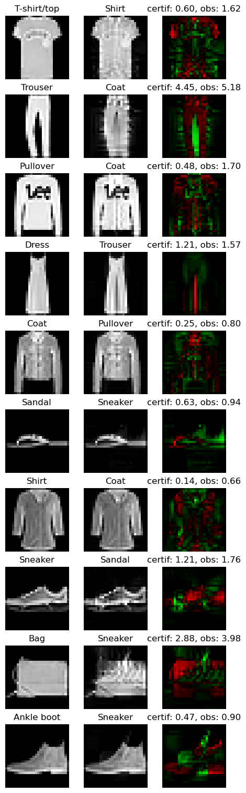

Example 4: HKR multiclass and fooling
=====================================

|Open in Colab|

This notebook will show how to train a Lispchitz network in a multiclass
configuration. The HKR (hinge-Kantorovich-Rubinstein) loss is extended
to multiclass using a one-vs all setup. The notebook will go through the
process of designing and training the network. It will also show how to
compute robustness certificates from the outputs of the network. Finally
the guarantee of these certificates will be checked by attacking the
network.

.. |Open in Colab| image:: https://colab.research.google.com/assets/colab-badge.svg
   :target: https://colab.research.google.com/github/deel-ai/deel-torchlip/blob/master/docs/notebooks/wasserstein_classification_fashionMNIST.ipynb

.. code:: ipython3

    # Install the required libraries deel-torchlip and foolbox (uncomment below if needed)
    # %pip install -qqq deel-torchlip foolbox

1. Data preparation
-------------------

For this example, the ``fashion_mnist`` dataset is used. In order to
keep things simple, no data augmentation is performed.

.. code:: ipython3

    import torch
    from torchvision import datasets, transforms
    
    train_set = datasets.FashionMNIST(
        root="./data",
        download=True,
        train=True,
        transform=transforms.ToTensor(),
    )
    
    test_set = datasets.FashionMNIST(
        root="./data",
        download=True,
        train=False,
        transform=transforms.ToTensor(),
    )
    
    batch_size = 100
    train_loader = torch.utils.data.DataLoader(train_set, batch_size, shuffle=True)
    test_loader = torch.utils.data.DataLoader(test_set, batch_size)

2. Model architecture
---------------------

The original one-vs-all setup would require 10 different networks (1 per
class). However, we use in practice a network with a common body and a
Lipschitz head (linear layer) containing 10 output neurons, like any
standard network for multiclass classification. Note that we use
torchlip.FrobeniusLinear disjoint_neurons=True to enforce each head
neuron to be a 1-Lipschitz function;

Notes about constraint enforcement
^^^^^^^^^^^^^^^^^^^^^^^^^^^^^^^^^^

There are currently 3 ways to enforce the Lipschitz constraint in a
network:

1. weight regularization
2. weight reparametrization
3. weight projection

Weight regularization doesn’t provide the required guarantees as it is
only a regularization term. Weight reparametrization is available in
``torchlip`` and is done directly in the layers (parameter
``niter_bjorck``). This trick allows to perform arbitrary gradient
updates without breaking the constraint. However this is done in the
graph, increasing resources consumption. Weight projection is not
implemented in ``torchlip``.

.. code:: ipython3

    from deel import torchlip
    
    # Sequential has the same properties as any Lipschitz layer. It only acts as a
    # container, with features specific to Lipschitz functions (condensation,
    # vanilla_exportation, ...)
    model = torchlip.Sequential(
        # Lipschitz layers preserve the API of their superclass (here Conv2d). An optional
        # argument is available, k_coef_lip, which controls the Lipschitz constant of the
        # layer
        torchlip.SpectralConv2d(
            in_channels=1, out_channels=16, kernel_size=(3, 3), padding="same"
        ),
        torchlip.GroupSort2(),
        # Usual pooling layer are implemented (avg, max), but new pooling layers are also
        # available
        torchlip.ScaledL2NormPool2d(kernel_size=(2, 2)),
        torchlip.SpectralConv2d(
            in_channels=16, out_channels=32, kernel_size=(3, 3), padding="same"
        ),
        torchlip.GroupSort2(),
        torchlip.ScaledL2NormPool2d(kernel_size=(2, 2)),
        # Our layers are fully interoperable with existing PyTorch layers
        torch.nn.Flatten(),
        torchlip.SpectralLinear(1568, 64),
        torchlip.GroupSort2(),
        torchlip.FrobeniusLinear(64, 10, bias=True, disjoint_neurons=True),
        # Similarly, model has a parameter to set the Lipschitz constant that automatically
        # sets the constant of each layer.
        k_coef_lip=1.0,
    )
    
    device = torch.device("cuda" if torch.cuda.is_available() else "cpu")
    model.to(device)

.. parsed-literal::

    Sequential(
      (0): ParametrizedSpectralConv2d(
        1, 16, kernel_size=(3, 3), stride=(1, 1), padding=same
        (parametrizations): ModuleDict(
          (weight): ParametrizationList(
            (0): _SpectralNorm()
            (1): _BjorckNorm()
            (2): _LConvNorm()
          )
        )
      )
      (1): GroupSort2()
      (2): ScaledL2NormPool2d(norm_type=2, kernel_size=(2, 2), stride=None, ceil_mode=False)
      (3): ParametrizedSpectralConv2d(
        16, 32, kernel_size=(3, 3), stride=(1, 1), padding=same
        (parametrizations): ModuleDict(
          (weight): ParametrizationList(
            (0): _SpectralNorm()
            (1): _BjorckNorm()
            (2): _LConvNorm()
          )
        )
      )
      (4): GroupSort2()
      (5): ScaledL2NormPool2d(norm_type=2, kernel_size=(2, 2), stride=None, ceil_mode=False)
      (6): Flatten(start_dim=1, end_dim=-1)
      (7): ParametrizedSpectralLinear(
        in_features=1568, out_features=64, bias=True
        (parametrizations): ModuleDict(
          (weight): ParametrizationList(
            (0): _SpectralNorm()
            (1): _BjorckNorm()
          )
        )
      )
      (8): GroupSort2()
      (9): ParametrizedFrobeniusLinear(
        in_features=64, out_features=10, bias=True
        (parametrizations): ModuleDict(
          (weight): ParametrizationList(
            (0): _FrobeniusNorm()
          )
        )
      )
    )

3. HKR loss and training
------------------------

The multiclass HKR loss can be found in the\ ``HKRMulticlassLoss``
class. The loss has two parameters: ``alpha`` and ``min_margin``.
Decreasing ``alpha`` and increasing ``min_margin`` improve robustness
(at the cost of accuracy). Note also in the case of Lipschitz networks,
more robustness requires more parameters. For more information, see `our
paper <https://arxiv.org/abs/2006.06520>`__.

In this setup, choosing ``alpha=0.99`` and ``min_margin=.25`` provides
good robustness without hurting the accuracy too much. An accurate
network can be obtained using ``alpha=0.999`` and ``min_margin=.1`` We
also propose the ``SoftHKRMulticlassLoss`` proposed in `this
paper <https://arxiv.org/abs/2206.06854>`__ that can achieve equivalent
performance to unconstrianed networks (92% validation accuracy with
``alpha=0.995``, ``min_margin=0.10``, ``temperature=50.0``). Finally the
``KRMulticlassLoss`` gives an indication on the robustness of the
network (proxy of the average certificate).

.. code:: ipython3

    loss_choice = "LseHKRMulticlassLoss" # "HKRMulticlassLoss" or "SoftHKRMulticlassLoss"or "LseHKRMulticlassLoss"
    epochs = 10
    
    optimizer = torch.optim.Adam(lr=1e-3, params=model.parameters())
    hkr_loss = None
    if loss_choice == "HKRMulticlassLoss":
        hkr_loss = torchlip.HKRMulticlassLoss(alpha=0.99, min_margin=0.25) #Robust
        #hkr_loss = torchlip.HKRMulticlassLoss(alpha=0.999, min_margin=0.10) #Accurate
    if loss_choice == "SoftHKRMulticlassLoss":
        hkr_loss = torchlip.SoftHKRMulticlassLoss(alpha=0.995, min_margin=0.10, temperature=50.0)
    if loss_choice == "LseHKRMulticlassLoss":
        hkr_loss = torchlip.LseHKRMulticlassLoss(alpha=0.9, min_margin=1.0, temperature=10.0)
    assert hkr_loss is not None, "Please choose a valid loss function"
    
    kr_multiclass_loss = torchlip.KRMulticlassLoss()
    
    for epoch in range(epochs):
        m_kr, m_acc = 0, 0
    
        for step, (data, target) in enumerate(train_loader):
    
            # For multiclass HKR loss, the targets must be one-hot encoded
            target = torch.nn.functional.one_hot(target, num_classes=10)
            data, target = data.to(device), target.to(device)
    
            # Forward + backward pass
            optimizer.zero_grad()
            output = model(data)
            loss = hkr_loss(output, target)
            loss.backward()
            optimizer.step()
    
            # Compute metrics on batch
            m_kr += kr_multiclass_loss(output, target)
            m_acc += (output.argmax(dim=1) == target.argmax(dim=1)).sum() / len(target)
    
        # Train metrics for the current epoch
        metrics = [
            f"{k}: {v:.04f}"
            for k, v in {
                "loss": loss,
                "acc": m_acc / (step + 1),
                "KR": m_kr / (step + 1),
            }.items()
        ]
    
        # Compute validation loss for the current epoch
        test_output, test_targets = [], []
        for data, target in test_loader:
            data, target = data.to(device), target.to(device)
            test_output.append(model(data).detach().cpu())
            test_targets.append(
                torch.nn.functional.one_hot(target, num_classes=10).detach().cpu()
            )
        test_output = torch.cat(test_output)
        test_targets = torch.cat(test_targets)
    
        val_loss = hkr_loss(test_output, test_targets)
        val_kr = kr_multiclass_loss(test_output, test_targets)
        val_acc = (test_output.argmax(dim=1) == test_targets.argmax(dim=1)).float().mean()
    
        # Validation metrics for the current epoch
        metrics += [
            f"val_{k}: {v:.04f}"
            for k, v in {
                "loss": hkr_loss(test_output, test_targets),
                "acc": (test_output.argmax(dim=1) == test_targets.argmax(dim=1))
                .float()
                .mean(),
                "KR": kr_multiclass_loss(test_output, test_targets),
            }.items()
        ]
    
        print(f"Epoch {epoch + 1}/{epochs}")
        print(" - ".join(metrics))

.. parsed-literal::

    Epoch 1/10
    loss: -0.2693 - acc: 0.7972 - KR: 0.5558 - val_loss: -0.0116 - val_acc: 0.8260 - val_KR: 0.9576

.. parsed-literal::

    Epoch 2/10
    loss: -0.1993 - acc: 0.8452 - KR: 1.2355 - val_loss: -0.2956 - val_acc: 0.8405 - val_KR: 1.4672

.. parsed-literal::

    Epoch 3/10
    loss: 0.2777 - acc: 0.8492 - KR: 1.6947 - val_loss: -0.4993 - val_acc: 0.8537 - val_KR: 1.8740

.. parsed-literal::

    Epoch 4/10
    loss: -0.8064 - acc: 0.8587 - KR: 1.9901 - val_loss: -0.6347 - val_acc: 0.8482 - val_KR: 2.1012

.. parsed-literal::

    Epoch 5/10
    loss: -0.3866 - acc: 0.8620 - KR: 2.1168 - val_loss: -0.6561 - val_acc: 0.8511 - val_KR: 2.1361

.. parsed-literal::

    Epoch 6/10
    loss: -0.7448 - acc: 0.8661 - KR: 2.1675 - val_loss: -0.7269 - val_acc: 0.8569 - val_KR: 2.1996

.. parsed-literal::

    Epoch 7/10
    loss: -1.1040 - acc: 0.8690 - KR: 2.1988 - val_loss: -0.8093 - val_acc: 0.8603 - val_KR: 2.1904

.. parsed-literal::

    Epoch 8/10
    loss: -0.8349 - acc: 0.8711 - KR: 2.2264 - val_loss: -0.8304 - val_acc: 0.8632 - val_KR: 2.2228

.. parsed-literal::

    Epoch 9/10
    loss: -0.6550 - acc: 0.8733 - KR: 2.2433 - val_loss: -0.8590 - val_acc: 0.8683 - val_KR: 2.2457

.. parsed-literal::

    Epoch 10/10
    loss: -0.5963 - acc: 0.8763 - KR: 2.2583 - val_loss: -0.8937 - val_acc: 0.8685 - val_KR: 2.2552

Evaluate lip constant for sanity check
--------------------------------------

The deel.torchlip.utils.evaluate_lip_const implements several methods to
evaluate this constant, either by adding random noise :math:`x+\epsilon`
and evaluating
:math:`\frac{\Vert{}F(x + \epsilon) - F(x)\Vert{}}{\Vert{}\epsilon\Vert{}}`,
or by an adversarial attack on :math:`\epsilon` to increase this value,
or by computing the jacobian norm :math:`||\nabla_x F(x)||`

It can be evaluated several times

.. code:: ipython3

    from deel.torchlip.utils import evaluate_lip_const

.. code:: ipython3

    x,y = next(iter(test_loader))
    evaluate_lip_const(model, x.to(device), evaluation_type="all", disjoint_neurons=True, double_attack=True, expected_value=1.0)

.. parsed-literal::

    Empirical lipschitz constant is 0.7989310622215271 with method jacobian_norm
    Empirical lipschitz constant is 0.2884121835231781 with method noise_norm
    Warning : double_attack is set to True,                 the computation time will be doubled

.. parsed-literal::

    Empirical lipschitz constant is 0.6641454100608826 with method attack

.. parsed-literal::

    0.7989310622215271

4. Model export
---------------

Once training is finished, the model can be optimized for inference by
using the ``vanilla_export()`` method. The ``torchlip`` layers are
converted to their PyTorch counterparts, e.g. ``SpectralConv2d``
layers will be converted into ``torch.nn.Conv2d`` layers.

Warnings:
~~~~~~~~~

vanilla_export method modifies the model in-place.

In order to build and export a new model while keeping the reference
one, it is required to follow these steps:

# Build e new mode for instance with torchlip.Sequential(
torchlip.SpectralConv2d(…), …)

``vanilla_model = <your_function_to_build_the_model>()``

# Copy the parameters from the reference t the new model

``vanilla_model.load_state_dict(model.state_dict())``

# one forward required to initialize pamatrizations

``vanilla_model(one_input)``

# vanilla_export the new model

``vanilla_model = vanilla_model.vanilla_export()``

.. code:: ipython3

    vanilla_model = model.vanilla_export()
    vanilla_model.eval()
    vanilla_model.to(device)

.. parsed-literal::

    Sequential(
      (0): Conv2d(1, 16, kernel_size=(3, 3), stride=(1, 1), padding=same)
      (1): GroupSort2()
      (2): LPPool2d(norm_type=2, kernel_size=(2, 2), stride=None, ceil_mode=False)
      (3): Conv2d(16, 32, kernel_size=(3, 3), stride=(1, 1), padding=same)
      (4): GroupSort2()
      (5): LPPool2d(norm_type=2, kernel_size=(2, 2), stride=None, ceil_mode=False)
      (6): Flatten(start_dim=1, end_dim=-1)
      (7): Linear(in_features=1568, out_features=64, bias=True)
      (8): GroupSort2()
      (9): Linear(in_features=64, out_features=10, bias=True)
    )

.. code:: ipython3

    x,y = next(iter(test_loader))
    evaluate_lip_const(vanilla_model, x.to(device), evaluation_type="all", disjoint_neurons=True, double_attack=True, expected_value=1.0)

.. parsed-literal::

    Empirical lipschitz constant is 0.7989310622215271 with method jacobian_norm
    Empirical lipschitz constant is 0.3023391366004944 with method noise_norm
    Warning : double_attack is set to True,                 the computation time will be doubled

.. parsed-literal::

    Empirical lipschitz constant is 0.7989276051521301 with method attack

.. parsed-literal::

    0.7989310622215271

5. Robustness evaluation: certificate generation and adversarial attacks
------------------------------------------------------------------------

A Lipschitz network provides certificates guaranteeing that there is no
adversarial attack smaller than the certificates. We will show how to
compute a certificate for a given image sample.

We will also run attacks on 10 images (one per class) and show that the
distance between the obtained adversarial images and the original images
is greater than the certificates. The ``foolbox`` library is used to
perform adversarial attacks.

.. code:: ipython3

    import numpy as np
    
    # Select only the first batch from the test set
    sub_data, sub_targets = next(iter(test_loader))
    sub_data, sub_targets = sub_data.to(device), sub_targets.to(device)
    
    # Drop misclassified elements
    output = vanilla_model(sub_data)
    well_classified_mask = output.argmax(dim=-1) == sub_targets
    sub_data = sub_data[well_classified_mask]
    sub_targets = sub_targets[well_classified_mask]
    
    # Retrieve one image per class
    images_list, targets_list = [], []
    for i in range(10):
        # Select the elements of the i-th label and keep the first one
        label_mask = sub_targets == i
        x = sub_data[label_mask][0]
        y = sub_targets[label_mask][0]
    
        images_list.append(x)
        targets_list.append(y)
    
    images = torch.stack(images_list)
    targets = torch.stack(targets_list)

In order to build a certificate :math:`\mathcal{M}` for a given sample,
we take the top-2 output and apply the following formula:

.. math::  \mathcal{M} = \frac{\text{top}_1 - \text{top}_2}{2} 

This certificate is a guarantee that no L2 attack can defeat the given
image sample with a robustness radius :math:`\epsilon` lower than the
certificate, i.e.

.. math::  \epsilon \geq \mathcal{M} 

In the following cell, we attack the model on the ten selected images
and compare the obtained radius :math:`\epsilon` with the certificates
:math:`\mathcal{M}`. In this setup, ``L2CarliniWagnerAttack`` from
``foolbox`` is used but in practice as these kind of networks are
gradient norm preserving, other attacks gives very similar results.

.. code:: ipython3

    import foolbox as fb
    
    # Compute certificates
    values, _ = vanilla_model(images).topk(k=2)
    #The factor is 2.0 when using disjoint_neurons==True
    certificates = (values[:, 0] - values[:, 1]) / 2. 
    
    # Run Carlini & Wagner attack
    fmodel = fb.PyTorchModel(vanilla_model, bounds=(0.0, 1.0), device=device)
    attack = fb.attacks.L2CarliniWagnerAttack(binary_search_steps=6, steps=8000)
    _, advs, success = attack(fmodel, images, targets, epsilons=None)
    dist_to_adv = (images - advs).square().sum(dim=(1, 2, 3)).sqrt()
    
    # Print results
    print("Image #     Certificate     Distance to adversarial")
    print("---------------------------------------------------")
    for i in range(len(certificates)):
        print(f"Image {i}        {certificates[i]:.3f}                {dist_to_adv[i]:.2f}")

.. parsed-literal::

    Image #     Certificate     Distance to adversarial
    ---------------------------------------------------
    Image 0        0.422                1.62
    Image 1        3.149                5.18
    Image 2        0.339                1.70
    Image 3        0.852                1.57
    Image 4        0.176                0.80
    Image 5        0.443                0.94
    Image 6        0.101                0.66
    Image 7        0.858                1.76
    Image 8        2.034                3.98
    Image 9        0.336                0.90

Finally, we can take a visual look at the obtained images. When looking
at the adversarial examples, we can see that the network has interesting
properties:

-  **Predictability**: by looking at the certificates, we can predict if
   the adversarial example will be close or not to the original image.
-  **Disparity among classes**: as we can see, the attacks are very
   efficent on similar classes (e.g. T-shirt/top, and Shirt). This
   denotes that all classes are not made equal regarding robustness.
-  **Explainability**: the network is more explainable as attacks can be
   used as counterfactuals. We can tell that removing the inscription on
   a T-shirt turns it into a shirt makes sense. Non-robust examples
   reveal that the network relies on textures rather on shapes to make
   its decision.

.. code:: ipython3

    import matplotlib.pyplot as plt
    
    def adversarial_viz(model, images, advs, class_names):
        """
        This functions shows for each image sample:
        - the original image
        - the adversarial image
        - the difference map
        - the certificate and the observed distance to adversarial
        """
        scale = 1.5
        nb_imgs = images.shape[0]
    
        # Compute certificates
        values, _ = model(images).topk(k=2)
        certificates = (values[:, 0] - values[:, 1]) / np.sqrt(2)
    
        # Compute distance between image and its adversarial
        dist_to_adv = (images - advs).square().sum(dim=(1, 2, 3)).sqrt()
    
        # Find predicted classes for images and their adversarials
        orig_classes = [class_names[i] for i in model(images).argmax(dim=-1)]
        advs_classes = [class_names[i] for i in model(advs).argmax(dim=-1)]
    
        # Compute difference maps
        advs = advs.detach().cpu()
        images = images.detach().cpu()
        diff_pos = np.clip(advs - images, 0, 1.0)
        diff_neg = np.clip(images - advs, 0, 1.0)
        diff_map = np.concatenate(
            [diff_neg, diff_pos, np.zeros_like(diff_neg)], axis=1
        ).transpose((0, 2, 3, 1))
    
        # Create plot
        def _set_ax(ax, title):
            ax.set_title(title)
            ax.set_xticks([])
            ax.set_yticks([])
            ax.axis("off")
    
        figsize = (3 * scale, nb_imgs * scale)
        _, axes = plt.subplots(
            ncols=3, nrows=nb_imgs, figsize=figsize, squeeze=False, constrained_layout=True
        )
        for i in range(nb_imgs):
            _set_ax(axes[i][0], orig_classes[i])
            axes[i][0].imshow(images[i].squeeze(), cmap="gray")
            _set_ax(axes[i][1], advs_classes[i])
            axes[i][1].imshow(advs[i].squeeze(), cmap="gray")
            _set_ax(axes[i][2], f"certif: {certificates[i]:.2f}, obs: {dist_to_adv[i]:.2f}")
            axes[i][2].imshow(diff_map[i] / diff_map[i].max())
    
    
    adversarial_viz(vanilla_model, images, advs, test_set.classes)

