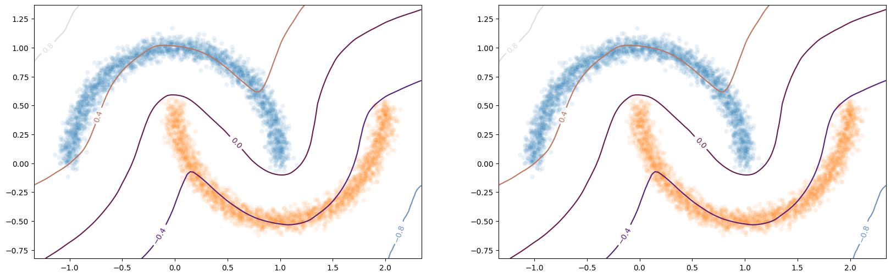

Example 2: HKR classifier on toy dataset
========================================

In this notebook we show how to build a robust classifier based on the
regularized version of the Kantorovitch-Rubinstein duality. We use the
``two moons`` synthetic dataset for our experiments.

1. Parameters
-------------

We first build our two moons dataset.

.. code:: ipython3

    from sklearn.datasets import make_moons, make_circles  # the synthetic dataset

    circle_or_moons = 1  # 0 for circle, 1 for moons
    n_samples = 5000  # number of sample in the dataset
    noise = 0.05  # amount of noise to add in the data. Tested with 0.14 for circles 0.05 for two moons
    factor = 0.4  # scale factor between the inner and the outer circle

.. code:: ipython3

    if circle_or_moons == 0:
        X, Y = make_circles(n_samples=n_samples, noise=noise, factor=factor)
    else:
        X, Y = make_moons(n_samples=n_samples, noise=noise)

    # When working with the HKR-classifier, using labels {-1, 1} instead of {0, 1} is advised.
    # This will be explained later on.
    Y[Y == 1] = -1
    Y[Y == 0] = 1

.. code:: ipython3

    import seaborn as sns

    X1 = X[Y == 1]
    X2 = X[Y == -1]
    sns.scatterplot(x=X1[:1000, 0], y=X1[:1000, 1])
    sns.scatterplot(x=X2[:1000, 0], y=X2[:1000, 1])

.. parsed-literal::

    Matplotlib created a temporary config/cache directory at /tmp/matplotlib-rrm0ylbr because the default path (/home/justin.plakoo/.config/matplotlib) is not a writable directory; it is highly recommended to set the MPLCONFIGDIR environment variable to a writable directory, in particular to speed up the import of Matplotlib and to better support multiprocessing.

.. parsed-literal::

    <AxesSubplot:>

.. image:: wasserstein_toy_classification_files/wasserstein_toy_classification_4_2.png

2. Relation with optimal transport
----------------------------------

In this setup we can solve the optimal transport problem between the
distribution of ``X[Y==1]`` and ``X[Y==-1]``. This usually require to
match each element of the first distribution with an element of the
second distribution such that this minimize a global cost. In our setup
this cost is the $ l_1 $ distance, which will allow us to make use of
the KR dual formulation. The overall cost is then the :math:`W_1`
distance.

2.1. Wasserstein distance
~~~~~~~~~~~~~~~~~~~~~~~~~

The wasserstein distance measure the distance between two probability
distributions. The Wikipedia article gives a more intuitive definition
of it:

   Intuitively, if each distribution is viewed as a unit amount of
   “dirt” piled on :math:`M`, the metric is the minimum “cost” of
   turning one pile into the other, which is assumed to be the amount of
   dirt that needs to be moved times the mean distance it has to be
   moved. Because of this analogy, the metric is known in computer
   science as the earth mover’s distance.

Mathematically it is defined as

.. math::

   W_1(\mu, \nu) = \inf_{\pi \in \Pi(\mu,\nu)} \underset{x, z \sim \pi}{\mathbb{E}} \Vert{} \textbf{x}-\textbf{z} \Vert{}

where :math:`\Pi(\mu,\nu)` is the set of all probability measures on
:math:`\Omega\times \Omega` with marginals :math:`\mu` and :math:`\nu`.
In most case this equation is not tractable.

However the :math:`W_1` distance is known to be untractable in general.

2.2. KR dual formulation
~~~~~~~~~~~~~~~~~~~~~~~~

The Kantorovich-Rubinestein (KR) dual formulation of the Wasserstein
distance is

.. math::  W_1(\mu, \nu) = \sup_{f \in Lip_1(\Omega)} \underset{\textbf{x} \sim \mu}{\mathbb{E}} \left[f(\textbf{x} )\right] -\underset{\textbf{x}  \sim \nu}{\mathbb{E}} \left[f(\textbf{x} )\right].

This state the problem as an optimization problem over the space of
1-Lipschitz functions. We can estimate this by optimizing over the space
of 1-Lipschitz neural networks.

2.3. Hinge-KR classification
~~~~~~~~~~~~~~~~~~~~~~~~~~~~

When dealing with :math:`W_1`, we usually try to optimize the
maximization problem above without taking into account the actual
classification task at hand. To improve robustness for our task, we want
our classifier :math:`F` to be centered in 0, which can be done without
altering the inital problem and its Lipschitz property. By doing so we
can use the obtained function for binary classification, by looking at
the sign of :math:`F`.

In order to enforce this, we will add a Hinge term to the loss. It has
been shown that this new problem is still a optimal transport problem
and that this problem admit a meaningfull optimal solution.

2.4. HKR-Classifier
~~~~~~~~~~~~~~~~~~~

Now we will show how to build a binary classifier based on the
regularized version of the KR dual problem.

In order to ensure the 1-Lipschitz constraint ``deel-lip``, uses
spectral normalization. These layers also can also use Bjork
orthonormalization to ensure that the gradient of the layer is 1 almost
everywhere. Experiment shows that the optimal solution lie in this
sub-class of functions.

.. code:: ipython3

    import torch
    from deel import torchlip

    device = torch.device("cuda" if torch.cuda.is_available() else "cpu")

    # Other lipschitz activations are ReLU, MaxMin, GroupSort2, GroupSort.
    wass = torchlip.Sequential(
        torchlip.SpectralLinear(2, 256),
        torchlip.FullSort(),
        torchlip.SpectralLinear(256, 128),
        torchlip.FullSort(),
        torchlip.SpectralLinear(128, 64),
        torchlip.FullSort(),
        torchlip.FrobeniusLinear(64, 1),
    ).to(device)

    wass

.. parsed-literal::

    Sequential(
      (0): SpectralLinear(in_features=2, out_features=256, bias=True)
      (1): FullSort()
      (2): SpectralLinear(in_features=256, out_features=128, bias=True)
      (3): FullSort()
      (4): SpectralLinear(in_features=128, out_features=64, bias=True)
      (5): FullSort()
      (6): FrobeniusLinear(in_features=64, out_features=1, bias=True)
    )

As we can see the network has a gradient equal to 1 almost everywhere as
all the layers respect this property.

It is good to note that the last layer is a ``FrobeniusDense`` this is
because, when we have a single output, it become equivalent to normalize
the frobenius norm and the spectral norm (as we only have a single
singular value)

2.5. Learn classification on toy dataset
~~~~~~~~~~~~~~~~~~~~~~~~~~~~~~~~~~~~~~~~

Now we are ready to learn the classification task on the two moons
dataset.

.. code:: ipython3

    from deel.torchlip.functional import kr_loss, hkr_loss, hinge_margin_loss
    from tqdm.notebook import trange, tqdm

    batch_size = 256
    n_epochs = 10

    alpha = 10
    min_margin = 0.29  # minimum margin to enforce between the values of F for each class

    optimizer = torch.optim.Adam(lr=0.01, params=wass.parameters())

    loader = torch.utils.data.DataLoader(
        torch.utils.data.TensorDataset(torch.tensor(X).float(), torch.tensor(Y).float()),
        batch_size=batch_size,
        shuffle=True,
    )

    tepochs = trange(n_epochs)
    for _ in tepochs:
        m_kr, m_hm, m_acc = 0, 0, 0

        tsteps = tqdm(loader)

        for step, (data, target) in enumerate(tsteps):
            data, target = data.to(device), target.to(device)
            optimizer.zero_grad()
            output = wass(data)
            loss = hkr_loss(output, target, alpha=alpha, min_margin=min_margin)
            loss.backward()
            optimizer.step()

            m_kr += kr_loss(output, target, (-1, 1))
            m_hm += hinge_margin_loss(output, target, min_margin)
            m_acc += (
                torch.sign(output.view(target.shape)) == torch.sign(target)
            ).sum() / len(target)
            tsteps.set_postfix(
                {
                    k: "{:.04f}".format(v)
                    for k, v in {
                        "loss": loss,
                        "kr": m_kr / (step + 1),
                        "hm": m_hm / (step + 1),
                        "acc": m_acc / (step + 1),
                    }.items()
                }
            )

        tepochs.set_postfix(
            {
                k: "{:.04f}".format(v)
                for k, v in {
                    "loss": loss,
                    "kr": m_kr / len(loader),
                    "hm": m_hm / len(loader),
                    "acc": m_acc / len(loader),
                }.items()
            }
        )

.. parsed-literal::

      0%|          | 0/10 [00:00<?, ?it/s]

.. parsed-literal::

      0%|          | 0/20 [00:00<?, ?it/s]

.. parsed-literal::

      0%|          | 0/20 [00:00<?, ?it/s]

.. parsed-literal::

      0%|          | 0/20 [00:00<?, ?it/s]

.. parsed-literal::

      0%|          | 0/20 [00:00<?, ?it/s]

.. parsed-literal::

      0%|          | 0/20 [00:00<?, ?it/s]

.. parsed-literal::

      0%|          | 0/20 [00:00<?, ?it/s]

.. parsed-literal::

      0%|          | 0/20 [00:00<?, ?it/s]

.. parsed-literal::

      0%|          | 0/20 [00:00<?, ?it/s]

.. parsed-literal::

      0%|          | 0/20 [00:00<?, ?it/s]

.. parsed-literal::

      0%|          | 0/20 [00:00<?, ?it/s]

2.6. Plot output countour line
~~~~~~~~~~~~~~~~~~~~~~~~~~~~~~

As we can see the classifier get a pretty good accuracy. We now look at
the actual function. Since we are in a two-dimensional space, we can
draw a countour plot to visualize :math:`F`.

.. code:: ipython3

    import matplotlib.pyplot as plt
    import numpy as np

    x = np.linspace(X[:, 0].min() - 0.2, X[:, 0].max() + 0.2, 120)
    y = np.linspace(X[:, 1].min() - 0.2, X[:, 1].max() + 0.2, 120)
    xx, yy = np.meshgrid(x, y, sparse=False)
    X_pred = np.stack((xx.ravel(), yy.ravel()), axis=1)

    # Make predictions from F:
    Y_pred = wass(torch.tensor(X_pred).float().to(device))
    Y_pred = Y_pred.reshape(x.shape[0], y.shape[0]).detach().cpu().numpy()

    # We are also going to check the exported version:
    vwass = wass.vanilla_export()
    Y_predv = vwass(torch.tensor(X_pred).float().to(device))
    Y_predv = Y_predv.reshape(x.shape[0], y.shape[0]).detach().cpu().numpy()

    # Plot the results:
    fig, (ax1, ax2) = plt.subplots(1, 2, figsize=(20, 6))

    sns.scatterplot(x=X[Y == 1, 0], y=X[Y == 1, 1], alpha=0.1, ax=ax1)
    sns.scatterplot(x=X[Y == -1, 0], y=X[Y == -1, 1], alpha=0.1, ax=ax1)
    cset = ax1.contour(xx, yy, Y_pred, cmap="twilight", levels=np.arange(-1.2, 1.2, 0.4))
    ax1.clabel(cset, inline=1, fontsize=10)

    sns.scatterplot(x=X[Y == 1, 0], y=X[Y == 1, 1], alpha=0.1, ax=ax2)
    sns.scatterplot(x=X[Y == -1, 0], y=X[Y == -1, 1], alpha=0.1, ax=ax2)
    cset = ax2.contour(xx, yy, Y_predv, cmap="twilight", levels=np.arange(-1.2, 1.2, 0.4))
    ax2.clabel(cset, inline=1, fontsize=10)

.. parsed-literal::

    <a list of 5 text.Text objects>

The ``vanilla_export()`` method allows us to obtain a ``torch`` module
without the overhead from the 1-Lipschitz constraints after training.

.. container:: alert alert-block alert-danger
